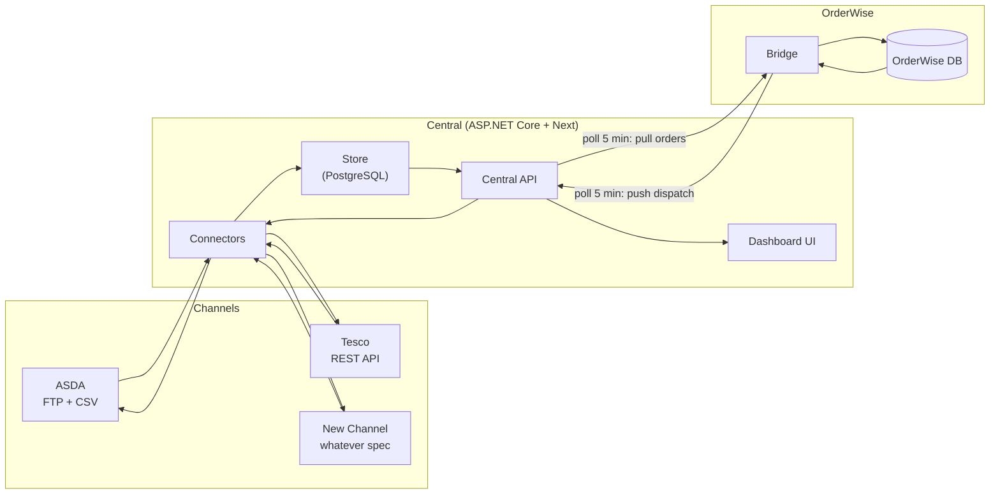

# Central → OrderWise — Structure & Mapping

_Pet project notes. Keep it simple. Status: design, not built._

> **Scope:** this is an **architecture-first MVP / showcase** — the focus is system design, not deep functionality. Stubbed or even broken internals are acceptable. Write the minimum code needed to show the architecture; no bloated code.

---

## 1. The idea in one line

One **Central** app (ASP.NET Core API + Next dashboard) talks to every channel (ASDA, Tesco, …).
One **Bridge** inside OrderWise talks only to Central.
Channels never touch OrderWise; OrderWise never touches channels.

The bridge **polls Central every 5 minutes**. Each cycle does both directions at once:
it **pulls** new orders down to OrderWise, and **pushes** dispatch updates up to Central.
(Central never calls into OrderWise — real-time push isn't possible into the plugin host.)

There are **two independent clocks**:
- **Bridge ↔ Central**: every **5 min** (fixed).
- **Central ↔ channel**: per-channel schedule (e.g. ASDA FTP every 15 min). Central can be much fresher than OrderWise.

```
ASDA (FTP) ──┐
Tesco (API) ─┼──►  CENTRAL  ──►  Bridge  ──►  OrderWise
NewCh (?)  ──┘   (dashboard)
```

---

## 2. Big picture



---

## 3. Pieces

| Piece | Lives in | Job |
|---|---|---|
| **Connectors** | Central | Talk to one channel (FTP/API), fetch/parse, map to canonical |
| **Store** | Central | Channels, orders, status, logs |
| **Central API** | Central | Endpoints the dashboard + bridge use |
| **Dashboard** | Next (React) | Login, view channels + orders + status |
| **Bridge** | OrderWise | The only OrderWise-facing code. Pulls orders, pushes dispatch |
| **OrderWise mock** | (pet project only) | Stand-in for the ERP so the loop runs without OrderWise — see §7 |

---

## 4. Tech stack

| Layer | Choice |
|---|---|
| Backend | **ASP.NET Core 10** Web API — **vanilla, no Aspire** (.NET 10 LTS, supported to Nov 2028) |
| ORM / DB | **EF Core + Npgsql** → **PostgreSQL** |
| Frontend | **Next.js** (React, TypeScript) + **Bootstrap CSS** |
| Auth | **ASP.NET Core Identity + JWT** (dashboard), **API key** (bridge) |
| Jobs | **Hangfire** (Postgres-backed) — **not Redis** |
| Cache | **`IMemoryCache`** (in-process) — **not Redis** |
| Logs | **Serilog** |
| Hosting | **Docker Compose** on one VPS + Caddy/nginx for HTTPS |

---

## 5. Caching, messaging, polling

- **Caching → `IMemoryCache` only.** Cache channel config, API tokens, dashboard counters. **No Redis** — it only pays off with multiple API instances; on one VPS it's pure overhead.
- **Messaging → no broker.** The design is poll-based (pull, not push), so no RabbitMQ/Kafka. The only need is a *durable job queue with retries* → **Hangfire** covers it on the Postgres we already have.
- **Polling → three separate places:**
  1. **Bridge ↔ Central** — the bridge's own 5-min timer; Central just exposes endpoints.
  2. **Central ↔ channels** — a Hangfire recurring job per channel (e.g. ASDA every 15 min).
  3. **Dashboard updates** — Next polls the API every 10–30s (react-query/SWR). SignalR is optional, not needed.

---

## 6. Data store

- **PostgreSQL**, provided blank → EF Core **migrations** create the schema, then a **seeder** fills dummy data (§13).
- Tables: `Channels`, `Orders`, `OrderLines`, `Products`, `SyncLogs`, `Users`, Hangfire's own tables.

---

## 7. OrderWise mock (pet project only)

We don't have a real OrderWise to load the plugin into, so the pet project runs against a **stand-in**:

- A small .NET app (`MockOrderWise`) faking the ERP: its own `orders` + `stock` store.
- Runs the **same bridge poll loop** (5 min, or a "Run now" button): pulls orders from Central, "imports" them into its store.
- Lets you **mark an order dispatched** → triggers the **export push** back to Central → proves the full round trip.
- The future real bridge is the *same logic* packaged as an OrderWise `IImportSOPlugin` / `IExportPlugin`.

```
[Central]  ◄──poll──►  [MockOrderWise] ── "dispatch" button ──► push back to Central
```

---

## 8. Flow — ASDA example (FTP + CSV)

1. ASDA drops an **order CSV** on an FTP folder.
2. Central's **ASDA connector** (Hangfire job) connects to FTP → downloads new files.
3. Connector **parses CSV** → canonical orders, dedupes by PO number.
4. Orders saved as `Received`. Dashboard shows: "ASDA — 12 new orders".
5. **Bridge** polls Central every 5 min → maps canonical → OrderWise `SalesOrder` → saves.
6. Central marks those orders `Imported`.

Reverse (dispatch back to ASDA):
1. Order dispatched in OrderWise.
2. Bridge pushes dispatch to Central.
3. ASDA connector **writes dispatch CSV** → uploads to FTP.
4. Central marks `DispatchSent`.

---

## 9. Flow — adding a NEW channel (4 types)

There are only **4 channel types** → build **4 connector templates**, not one per client.

| Type | Transport | Format | Example |
|---|---|---|---|
| **A** | FTP | CSV | ASDA |
| **B** | FTP | EDI | (new) |
| **C** | API | REST / JSON | Tesco |
| **D** | API | GraphQL | (new) |

New client = pick a template + config + field mapping. Goal: **no OrderWise change ever.**

1. **Add a channel** record: key, name, **type (A/B/C/D)**, endpoint/credentials, field mapping, schedule.
2. **Reuse the template** for that type.
3. **Map their fields → canonical**.
4. **Register it** → dashboard shows it automatically.
5. Done — bridge untouched.

> Bespoke connector only if a client is genuinely exotic. EDI is the heaviest of the four.

```csharp
// 4 template implementations behind one interface — lives in Central, NOT OrderWise
public interface IPartnerConnector
{
    ChannelType Type { get; }                  // FtpCsv | FtpEdi | ApiRest | ApiGraphQl
    Task<IReadOnlyList<CanonicalOrder>> PullOrdersAsync(CancellationToken ct);
    Task PushDispatchAsync(CanonicalDispatch dispatch, CancellationToken ct);
}
```

---

## 10. Canonical model & mapping

### 10.1 Canonical order

```
Order
├─ ChannelKey        "asda"
├─ OrderNumber       PO number
├─ CustomerRef       client's own ref
├─ OrderDate
├─ RequiredDate
├─ Customer
│   ├─ Name
│   ├─ DeliveryAddress { Addr1..4, Town, County, Country, Postcode }
│   ├─ Phone, Email
├─ Lines[]
│   ├─ Sku            (maps to OrderWise Code / eCommerceCode)
│   ├─ LineRef
│   ├─ Quantity
│   ├─ UnitPrice
│   └─ TaxCode
└─ Status            Received | Imported | DispatchSent | Error
```

### 10.2 ASDA CSV → Canonical

| ASDA CSV column | Canonical |
|---|---|
| PurchaseOrderNumber | OrderNumber |
| SalesOrderNumber | CustomerRef |
| OrderDate | OrderDate |
| EstimatedDeliveryDate | RequiredDate |
| CustomerFirstName + LastName | Customer.Name |
| DeliveryAddressLine1..4 | Customer.DeliveryAddress |
| DeliveryPostCode / DeliveryCountry | Postcode / Country |
| Phone / Email | Customer.Phone / Email |
| ItemId | Lines[].Sku |
| PurchaseOrderLineNumber | Lines[].LineRef |
| Quantity | Lines[].Quantity |

### 10.3 Canonical → OrderWise `SalesOrder`

| Canonical | OrderWise `SalesOrder` |
|---|---|
| OrderNumber | `OrderNumber` |
| CustomerRef | `CustomerOrderRef` |
| OrderDate | `OrderDate` |
| RequiredDate | `RequiredDate` + `PromisedDate` |
| Customer.Name | `Customer.StatementName` / `InvoiceName` |
| DeliveryAddress | `Customer.DeliveryAddress` + `Statement*` fields |
| Lines[].Sku | `SalesOrderLine.Code` + `eCommerceCode` |
| Lines[].LineRef | `SalesOrderLine.eCommerceItemID` |
| Lines[].Quantity | `SalesOrderLine.Quantity` |
| Lines[].UnitPrice | `SalesOrderLine.ItemGross` |
| Lines[].TaxCode | `SalesOrderLine.TaxCode` |

---

## 11. Dashboard

- **Login** (§12).
- **Channels list**: name, type, last sync, status (green/amber/red).
- **Channel detail**: its orders + status (`Received` / `Imported` / `DispatchSent` / `Error`).
- **Orders view**: filter by channel, status, date.
- **Logs / errors**: what failed, when, why. Replay a failed order.
- **Counters**: new today, pending import, dispatched.

---

## 12. Login / auth

- Central API: **ASP.NET Core Identity**, **single seeded admin user** → JWT (or cookie).
- Dashboard (Next): login page → stores token → calls API with it.
- **Bridge → Central API**: a simple **API key** header (not a user login).

---

## 13. Seed data (dummy)

Company = bedding manufacturer. Products across **5 categories**, with realistic variants:

| Category | Variants (examples) |
|---|---|
| **Pillows** | firmness (Soft/Medium/Firm), pack (1/2/4) |
| **Duvets** | tog (4.5/10.5/13.5/15), size (Single/Double/King/Super King) |
| **Mattress Protectors** | size, type (waterproof/quilted), depth |
| **Mattress Toppers** | size, thickness (2"/4"), filling |
| **Pet Beds** | size (S/M/L), type (donut/mat/crate) |

Plus:
- **Channels**: ASDA, Tesco, Temu, Shopify, Dunelm, Debenhams.
- **Orders + lines** across all statuses, referencing those SKUs.
- **Sync logs**, and **1 admin user**.
- Seeded via EF Core `HasData` or a seed command.

---

## 14. Project structure

```
lrn_net_orderdash/                 (repo root)
├─ lib/                            docs + reference
│  ├─ centralization-flow.md       (this file)
│  └─ checks/                      original plugins — reference only
└─ code/                           ← ALL development goes here
   ├─ Central.Api/                 ASP.NET Core — REST + auth + Hangfire + seed
   ├─ Central.Core/                canonical models, IPartnerConnector, mapping
   ├─ Central.Channels/            4 templates: FtpCsv, FtpEdi, ApiRest, ApiGraphQl
   ├─ Central.Dashboard/           Next.js (React) + Bootstrap UI
   ├─ MockOrderWise/               stand-in for the ERP + bridge loop (§7)
   ├─ Bridge.OrderWise/            the real plugin later (.NET Framework 4.7.1)
   ├─ docker-compose.yml           postgres + api + dashboard
   ├─ .env                         dev secrets / connection string (git-ignored)
   └─ .gitignore
```

---

## 15. Build order

1. **Central.Core** — canonical model (§10.1).
2. **Postgres + EF migrations + seeder** (§6, §13).
3. **Bridge ↔ Central contract** — endpoints: `GET /orders/pending`, `POST /dispatch` (+ idempotency key).
4. **One connector** — ASDA FTP-CSV template (§8).
5. **MockOrderWise** — close the loop end to end (§7).
6. **Central.Api** — Hangfire jobs, API key auth.
7. **Dashboard** — login, channels, orders (§11, §12).
8. Second connector to prove the template pattern (a REST one, e.g. Tesco).
9. Add the remaining templates (FTP-EDI, API-GraphQL).
10. Later: the real `Bridge.OrderWise` plugin.

---

## 16. Decisions (and why)

| Decision | Why |
|---|---|
| **Hangfire over Redis** | Hangfire is a *library* — no new server, it leans on the Postgres we already run. Redis is a whole extra container to run/secure/back up. |
| **No Redis at all** | `IMemoryCache` covers caching on a single instance. Redis only pays off with multiple API instances. |
| **Vanilla ASP.NET Core over Aspire** | Aspire is **dev-time orchestration only** — you'd still ship Docker Compose to prod. One VPS + compose already orchestrates, and the frontend is Next.js (not .NET), so Aspire adds concepts without removing anything. |
| **No message broker** | Design is poll-based (pull). A broker would be over-engineering; Hangfire gives durable jobs + retries. |
| **Bootstrap CSS** | Fast, familiar, no build fuss — good enough to showcase the dashboard. |
| **.NET 10 (not 8)** | .NET 8 and 9 both hit end of support 10 Nov 2026. .NET 10 is the current LTS (to Nov 2028). |
| **Bridge stays .NET Framework 4.7.1** | That's OrderWise's plugin host — unrelated to the .NET 10 choice. |

> Reminder: MVP / architecture showcase. Stub anything deep (real FTP, real EDI parse, real GraphQL) — the point is to show the architecture, not ship it.

---

## 17. Prerequisites & setup (locked)

**Verified on the machine:** .NET SDK **10.0.401**, Node **v24**, Docker **29** + Compose **v5**.

**Decisions locked:**
- **Postgres runs in docker-compose** — self-contained, **no external DB credentials needed**.
- **git** repo = `lrn_net_orderdash` (docs in `lib/`, code in `code/`).
- Seeded **default admin** user (dev creds in `.env`, changeable).
- Dev secrets (JWT key, API key) = generated **placeholders** in `.env`.
- Channels (FTP/EDI/REST/GraphQL) + MockOrderWise = **stubbed**.

**Not needed:** FTP credentials, channel API keys, real OrderWise.

**Where:** code under `code/`; docs in `lib/` (§14).

---

## 18. Git & delivery

- **Repo:** `lrn_net_orderdash` — docs in `lib/`, code in `code/`.
- **Commit + push per phase — pre-authorised.** After each §15 phase: commit (e.g. `phase 3: bridge ↔ central contract`) and **push straight to `main`** automatically — no need to ask each time.
- **Remote + credentials are configured**, so pushes should succeed. If one fails, I'll report it and leave the commit local.
- **Never** force-push.
- **`.gitignore` must cover:** `.env`, `bin/`, `obj/`, `node_modules/`, `.next/`, `data/`.
- **Secrets never committed** — `.env` stays local; commit a `.env.example` with placeholders instead.
